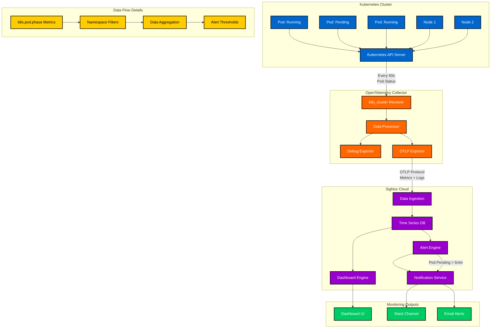
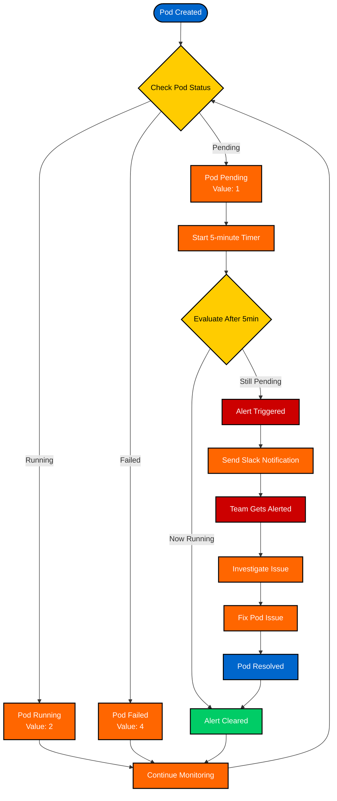

# Kubernetes Pod Monitoring with SigNoz: A Complete Guide to Detecting Stuck Pods

## Table of Contents
1. [Introduction](#introduction)
2. [What is Observability and Why Do We Need It?](#what-is-observability)
3. [Understanding OpenTelemetry](#understanding-opentelemetry)
4. [Problem Statement: Monitoring Stuck Pods](#problem-statement)
5. [Prerequisites](#prerequisites)
6. [Step-by-Step Implementation](#step-by-step-implementation)
7. [Creating the Dashboard](#creating-the-dashboard)
8. [Setting Up Alerts](#setting-up-alerts)
9. [Testing the Solution](#testing-the-solution)
60. [Troubleshooting](#troubleshooting)
11. [Conclusion](#conclusion)

---

## Introduction

In today's cloud-native world, Kubernetes has become the de facto standard for container orchestration. However, with great power comes great responsibility - monitoring your Kubernetes clusters is crucial for maintaining application reliability and performance.

This guide will walk you through setting up comprehensive pod monitoring using SigNoz, an open-source observability platform. We'll focus on a common but critical issue: detecting pods that get stuck in a "Pending" state for extended periods.

**What you'll learn:**
- How to set up OpenTelemetry Collector in Kubernetes
- How to create monitoring dashboards in SigNoz
- How to configure alerts for stuck pods
- How to integrate Slack notifications

---

## What is Observability and Why Do We Need It?

### Understanding Observability

**Observability** is the ability to understand what's happening inside your system by looking at its external outputs. Think of it like a car's dashboard - you can't see the engine directly, but you can monitor speed, fuel level, temperature, and other indicators to understand how the car is performing.

In software systems, observability is achieved through three main pillars:

1. **Metrics** - Numerical data points over time (CPU usage, memory consumption, request rates)
2. **Logs** - Text records of events that happened in your system
3. **Traces** - Records of requests as they flow through your system

### Why Kubernetes Monitoring Matters

Kubernetes clusters are complex systems with many moving parts:
- **Pods** (your applications)
- **Nodes** (servers running your pods)
- **Services** (networking between pods)
- **Controllers** (managing pod lifecycles)

Without proper monitoring, you might not know when:
- A pod fails to start
- A pod gets stuck in an unhealthy state
- Resource constraints prevent pod scheduling
- Network issues affect your applications

---

## Understanding OpenTelemetry

### What is OpenTelemetry?

**OpenTelemetry** is an open-source project that provides a unified way to collect observability data from your applications and infrastructure. It's like having a universal translator for monitoring data.

### Key Components

1. **OpenTelemetry Collector** - A service that receives, processes, and exports telemetry data
2. **Receivers** - Components that collect data from various sources
3. **Exporters** - Components that send data to different destinations (like SigNoz)
4. **Processors** - Components that transform or filter data

### How It Works in Kubernetes

```
Kubernetes API → OpenTelemetry Collector → SigNoz Cloud
     ↓                    ↓                    ↓
  Pod Metrics        Data Processing      Visualization
  Node Metrics       & Enrichment         & Alerting
  Event Data         & Export
```

### Complete Workflow Structure

Here's a detailed 2D workflow diagram showing how the entire monitoring system works:



### Workflow Explanation

**1. Data Collection Phase:**
- Kubernetes API Server exposes pod status information
- OpenTelemetry Collector's `k8s_cluster` receiver polls the API every 60 seconds
- Collects metrics like `k8s.pod.phase`, `k8s.pod.name`, `k8s.namespace.name`

**2. Data Processing Phase:**
- Raw metrics are processed and enriched with metadata
- Debug exporter logs metrics to collector console for troubleshooting
- OTLP exporter formats data for SigNoz Cloud ingestion

**3. Data Storage Phase:**
- SigNoz Cloud receives data via OTLP protocol
- Data is stored in time-series database
- Indexed by metrics, tags, and timestamps

**4. Visualization Phase:**
- Dashboard engine queries stored data
- Real-time visualization of pod states
- Updates every 60 seconds with new data

**5. Alerting Phase:**
- Alert engine continuously evaluates stored metrics
- Checks for conditions (pod phase = 1 for > 5 minutes)
- Triggers notifications when thresholds are exceeded

**6. Notification Phase:**
- Notification service sends alerts to configured channels
- Slack webhooks, email, or other integrations
- Includes relevant context and pod information

---

## Problem Statement: Monitoring Stuck Pods

### The Challenge

In Kubernetes, pods can get stuck in a "Pending" state for various reasons:
- **Resource constraints** - Not enough CPU/memory available
- **Node affinity issues** - Pod requirements don't match available nodes
- **Storage problems** - Persistent volume claims can't be satisfied
- **Network issues** - Pod can't be scheduled due to network policies

### Why This Matters

A pod stuck in Pending state means:
- Your application isn't running
- Users can't access your service
- Your system is partially down
- You might not notice until users complain

### Our Solution

We'll create a monitoring system that:
1. **Collects** pod phase metrics from Kubernetes
2. **Visualizes** pod states in a dashboard
3. **Alerts** when pods are stuck in Pending for more than 5 minutes
4. **Notifies** your team via Slack

---

## Prerequisites

Before we start, you'll need:

### Technical Requirements
- A Kubernetes cluster (local or cloud)
- `kubectl` configured to access your cluster
- Access to SigNoz Cloud (we'll provide a signup link)

### Knowledge Requirements
- Basic understanding of Kubernetes concepts (pods, namespaces, deployments)
- Familiarity with YAML files
- Basic command-line usage

---

## Step-by-Step Implementation

### Step 1: Create a Namespace

First, let's create a dedicated namespace for our monitoring setup:

```bash
kubectl create namespace signoz-demo
```

**Why a separate namespace?** It keeps our monitoring components organized and separate from your application workloads.

### Step 2: Set Up OpenTelemetry Collector

The OpenTelemetry Collector is the heart of our monitoring system. It will collect metrics from your Kubernetes cluster and send them to SigNoz.

#### 2.1 Create the ConfigMap

Create a file called `configmap.yml`:

```yaml
apiVersion: v1
kind: ConfigMap
metadata:
  name: otelcontribcol
  labels:
    app: otelcontribcol
data:
  config.yaml: |
    receivers:
      k8s_cluster:
        collection_interval: 60s
    exporters:
      debug:
      otlp:
        endpoint: "ingest.in.signoz.cloud:443"
        tls:
          insecure: false
        timeout: 20s
        headers:
          "signoz-ingestion-key": "YOUR_INGESTION_KEY_HERE"
    service:
      pipelines:
        metrics:
          receivers: [k8s_cluster]
          exporters: [debug, otlp]
        logs/entity_events:
          receivers: [k8s_cluster]
          exporters: [debug, otlp]
```

**What this does:**
- `k8s_cluster` receiver collects Kubernetes metrics every 60 seconds
- `debug` exporter logs metrics to the collector's console (for troubleshooting)
- `otlp` exporter sends metrics to SigNoz Cloud
- You'll need to replace `YOUR_INGESTION_KEY_HERE` with your actual SigNoz ingestion key

#### 2.2 Create the Service Account

Create a file called `serviceaccount.yml`:

```yaml
apiVersion: v1
kind: ServiceAccount
metadata:
  name: otelcontribcol
  namespace: signoz-demo
  labels:
    app: otelcontribcol
```

**What this does:** Creates a service account that the OpenTelemetry Collector will use to authenticate with the Kubernetes API.

#### 2.3 Create the ClusterRole

Create a file called `clusterrole.yml`:

```yaml
apiVersion: rbac.authorization.k8s.io/v1
kind: ClusterRole
metadata:
  name: otelcontribcol
  labels:
    app: otelcontribcol
rules:
- apiGroups: [""]
  resources: [events, namespaces, namespaces/status, nodes, nodes/spec,
              pods, pods/status, replicationcontrollers, replicationcontrollers/status,
              resourcequotas, services]
  verbs: [get, list, watch]
- apiGroups: ["apps"]
  resources: [daemonsets, deployments, replicasets, statefulsets]
  verbs: [get, list, watch]
- apiGroups: ["extensions"]
  resources: [daemonsets, deployments, replicasets]
  verbs: [get, list, watch]
- apiGroups: ["batch"]
  resources: [jobs, cronjobs]
  verbs: [get, list, watch]
- apiGroups: ["autoscaling"]
  resources: [horizontalpodautoscalers]
  verbs: [get, list, watch]
```

**What this does:** Defines the permissions the collector needs to read Kubernetes resources (pods, nodes, services, etc.).

#### 2.4 Create the ClusterRoleBinding

Create a file called `clusterrolebinding.yml`:

```yaml
apiVersion: rbac.authorization.k8s.io/v1
kind: ClusterRoleBinding
metadata:
  name: otelcontribcol
  labels:
    app: otelcontribcol
roleRef:
  apiGroup: rbac.authorization.k8s.io
  kind: ClusterRole
  name: otelcontribcol
subjects:
- kind: ServiceAccount
  name: otelcontribcol
  namespace: signoz-demo
```

**What this does:** Binds the permissions (ClusterRole) to our service account.

#### 2.5 Create the Deployment

Create a file called `deployment.yaml`:

```yaml
apiVersion: apps/v1
kind: Deployment
metadata:
  name: otelcontribcol
  labels:
    app: otelcontribcol
spec:
  replicas: 1
  selector:
    matchLabels:
      app: otelcontribcol
  template:
    metadata:
      labels:
        app: otelcontribcol
    spec:
      serviceAccountName: otelcontribcol
      containers:
      - name: otelcontribcol
        image: otel/opentelemetry-collector-contrib
        args: ["--config", "/etc/config/config.yaml"]
        imagePullPolicy: IfNotPresent
        volumeMounts:
        - name: config
          mountPath: /etc/config
      volumes:
      - name: config
        configMap:
          name: otelcontribcol
```

**What this does:** Deploys the OpenTelemetry Collector as a pod in your cluster.

#### 2.6 Apply All Components

Apply all the YAML files to your cluster:

```bash
kubectl apply -f configmap.yml -n signoz-demo
kubectl apply -f serviceaccount.yml -n signoz-demo
kubectl apply -f clusterrole.yml -n signoz-demo
kubectl apply -f clusterrolebinding.yml -n signoz-demo
kubectl apply -f deployment.yaml -n signoz-demo
```

### Step 3: Verify the Setup

Check that the collector is running:

```bash
kubectl get pods -n signoz-demo
```

You should see something like:
```
NAME                              READY   STATUS    RESTARTS   AGE
otelcontribcol-xxxxxxxxx-xxxxx    1/1     Running   0          2m
```

### Step 4: Create a Test Pod

Let's create a pod that will intentionally get stuck in Pending state for testing:

Create a file called `test-pending-pod.yaml`:

```yaml
apiVersion: v1
kind: Pod
metadata:
  name: test-pending-pod
  namespace: signoz-demo
  labels:
    app: test-pending-pod
spec:
  containers:
  - name: test-container
    image: nginx:latest
    resources:
      requests:
        cpu: "6000"  # Requesting more CPU than available
        memory: "2Gi"
      limits:
        cpu: "6000"
        memory: "2Gi"
  nodeSelector:
    non-existent-node: "true"  # This will keep the pod pending
```

Apply it:

```bash
kubectl apply -f test-pending-pod.yaml -n signoz-demo
```

Verify it's stuck in Pending:

```bash
kubectl get pods -n signoz-demo
```

You should see:
```
NAME                              READY   STATUS    RESTARTS   AGE
otelcontribcol-xxxxxxxxx-xxxxx    1/1     Running   0          5m
test-pending-pod                  0/1     Pending   0          1m
```

---

## Creating the Dashboard

Now let's create a dashboard in SigNoz to visualize our pod metrics.

### Step 1: Access SigNoz Cloud

1. Go to your SigNoz Cloud dashboard
2. Navigate to **Dashboards** in the left sidebar
3. Click **"+ New Dashboard"**

### Step 2: Import the Dashboard Configuration

We've prepared a minimal dashboard configuration that focuses on pod phase monitoring. Here's the configuration:

```json
{
  "collapsableRowsMigrated": true,
  "description": "Kubernetes Pod Metrics Dashboard for signoz-demo namespace - Monitoring pods and triggering alerts when stuck in pending state for over 5 minutes",
  "dotMigrated": true,
  "layout": [
    {
      "h": 12,
      "i": "pod-phase-panel",
      "moved": false,
      "static": false,
      "w": 12,
      "x": 0,
      "y": 0
    }
  ],
  "name": "",
  "panelMap": {},
  "tags": [
    "pod",
    "k8s",
    "signoz-demo",
    "pending-alert"
  ],
  "title": "Kubernetes Pod Metrics - signoz-demo Namespace",
  "uploadedGrafana": false,
  "variables": {},
  "version": "v4",
  "widgets": [
    {
      "description": "Pod Phase Status - Critical for monitoring pending pods that need alerts. Shows pod lifecycle states: 1=Pending, 2=Running, 3=Succeeded, 4=Failed, 5=Unknown",
      "id": "pod-phase-panel",
      "isStacked": false,
      "nullZeroValues": "zero",
      "opacity": "1",
      "panelTypes": "graph",
      "query": {
        "builder": {
          "queryData": [
            {
              "aggregateAttribute": {
                "dataType": "float64",
                "id": "k8s.pod.phase--float64----true",
                "isColumn": true,
                "key": "k8s.pod.phase",
                "type": ""
              },
              "aggregateOperator": "avg",
              "dataSource": "metrics",
              "disabled": false,
              "expression": "A",
              "filters": {
                "items": [
                  {
                    "id": "namespace-filter",
                    "key": {
                      "dataType": "string",
                      "id": "k8s.namespace.name--string--tag--false",
                      "isColumn": false,
                      "key": "k8s.namespace.name",
                      "type": "tag"
                    },
                    "op": "=",
                    "value": "signoz-demo"
                  }
                ],
                "op": "AND"
              },
              "groupBy": [
                {
                  "dataType": "string",
                  "id": "k8s.pod.name--string--tag--false",
                  "isColumn": false,
                  "key": "k8s.pod.name",
                  "type": "tag"
                }
              ],
              "having": [],
              "legend": "{{k8s.pod.name}}",
              "limit": null,
              "orderBy": [],
              "queryName": "A",
              "reduceTo": "sum",
              "spaceAggregation": "sum",
              "stepInterval": 60,
              "timeAggregation": "avg"
            }
          ],
          "queryFormulas": []
        },
        "queryType": "builder"
      },
      "timePreferance": "GLOBAL_TIME",
      "title": "Pod Phase Status (1=Pending, 2=Running, 3=Succeeded, 4=Failed, 5=Unknown)",
      "yAxisUnit": "none"
    }
  ]
}
```

### Step 3: Configure the Dashboard

1. **Import the Configuration:**
   - Copy the JSON configuration above
   - In SigNoz, click **"Import Dashboard"**
   - Paste the JSON configuration
   - Click **"Import"**

2. **Verify the Dashboard:**
   - You should see a single panel showing pod phase status
   - The `test-pending-pod` should appear as a line at value `1` (Pending)
   - Other pods should appear at value `2` (Running)

### Understanding the Dashboard

**What you're seeing:**
- **Y-axis:** Pod phase values (1=Pending, 2=Running, 3=Succeeded, 4=Failed, 5=Unknown)
- **X-axis:** Time
- **Lines:** Each line represents a pod, showing its phase over time
- **Pending pods:** Appear as horizontal lines at value `1`
- **Running pods:** Appear as horizontal lines at value `2`

---

## Setting Up Alerts

Now let's create an alert that will notify you when a pod is stuck in Pending state for more than 5 minutes.

### Alert Workflow Structure

Here's a focused workflow diagram showing how the alert system works:



### Alert Flow Explanation

**1. Pod Lifecycle Monitoring:**
- Every pod goes through different states (Pending, Running, Failed, etc.)
- OpenTelemetry Collector continuously monitors these states
- Each state has a numeric value (1=Pending, 2=Running, 4=Failed)

**2. Pending State Detection:**
- When a pod enters Pending state (value = 1), monitoring begins
- A 5-minute timer starts counting down
- System continues to check pod status every minute

**3. Alert Evaluation:**
- After 5 minutes, system evaluates if pod is still pending
- If still pending → Alert triggers
- If now running → Alert is cleared (no notification needed)

**4. Notification Process:**
- Alert triggers Slack notification with pod details
- Team receives immediate notification
- Includes pod name, namespace, and duration information

**5. Resolution Process:**
- Team investigates the pending pod issue
- Fixes the underlying problem (resource constraints, node issues, etc.)
- Pod transitions to Running state
- Alert automatically clears

**6. Continuous Monitoring:**
- System continues monitoring all pods
- Process repeats for any new pending pods
- Provides ongoing protection against stuck pods

### Step 1: Access Alerts in SigNoz

1. Go to **Alerts** in the left sidebar
2. Click **"+ New Alert"**

### Step 2: Configure the Alert

#### 2.1 Define the Metric

1. **Alert Type:** Select "Threshold Alert"
2. **Metric:** Choose `k8s.pod.phase`
3. **Filter:** Add `k8s.namespace.name = 'signoz-demo'`
4. **Aggregation:** 
   - Within time series: `Avg` every `60 Seconds`
   - Across time series: `Sum` by `k8s.pod.name`

#### 2.2 Define Alert Conditions

1. **Condition:** "A is equal to the threshold"
2. **Threshold:** `1` (since Pending = 1)
3. **Duration:** "at least once during the last 5 mins"
4. **Frequency:** Run alert every `1 min`

#### 2.3 Alert Configuration

1. **Alert Name:** "Pod Stuck in Pending - signoz-demo Namespace"
2. **Description:** "Alert when a pod in signoz-demo namespace is stuck in pending state for over 5 minutes"
3. **Severity:** "Critical"
4. **Labels:** Add `k8s`, `pod`, `pending`, `signoz-demo`

#### 2.4 Notification Channels

1. **Create Slack Channel:**
   - Click "select one or more channels"
   - Click "+ New Channel"
   - Type: Slack
   - Webhook URL: `https://hooks.slack.com/services/YOUR/SLACK/WEBHOOK`
   - Channel Name: `kubernetes-alerts`

2. **Test Notification:**
   - Click "Test Notification" to verify Slack integration

### Step 3: Create the Alert

1. **Review Configuration:**
   - Ensure threshold is `1` and condition is `equal to`
   - Verify all settings are correct

2. **Create Rule:**
   - Click "Create Rule"

### Expected Alert Configuration

Here's the complete alert configuration for reference:

```json
{
  "name": "Pod Stuck in Pending - signoz-demo Namespace",
  "description": "Alert when a pod in signoz-demo namespace is stuck in pending state for over 5 minutes",
  "condition": {
    "query": {
      "builder": {
        "queryData": [
          {
            "aggregateAttribute": {
              "dataType": "float64",
              "id": "k8s.pod.phase--float64----true",
              "isColumn": true,
              "key": "k8s.pod.phase",
              "type": ""
            },
            "aggregateOperator": "avg",
            "dataSource": "metrics",
            "disabled": false,
            "expression": "A",
            "filters": {
              "items": [
                {
                  "id": "namespace-filter",
                  "key": {
                    "dataType": "string",
                    "id": "k8s.namespace.name--string--tag--false",
                    "isColumn": false,
                    "key": "k8s.namespace.name",
                    "type": "tag"
                  },
                  "op": "=",
                  "value": "signoz-demo"
                },
                {
                  "id": "phase-filter",
                  "key": {
                    "dataType": "string",
                    "id": "k8s.pod.phase--string--tag--false",
                    "isColumn": false,
                    "key": "k8s.pod.phase",
                    "type": "tag"
                  },
                  "op": "=",
                  "value": "1"
                }
              ],
              "op": "AND"
            },
            "groupBy": [
              {
                "dataType": "string",
                "id": "k8s.pod.name--string--tag--false",
                "isColumn": false,
                "key": "k8s.pod.name",
                "type": "tag"
              }
            ],
            "having": [],
            "legend": "{{k8s.pod.name}}",
            "limit": null,
            "orderBy": [],
            "queryName": "A",
            "reduceTo": "sum",
            "spaceAggregation": "sum",
            "stepInterval": 60,
            "timeAggregation": "avg"
          }
        ],
        "queryFormulas": []
      },
      "queryType": "builder"
    },
    "threshold": {
      "value": 1,
      "operator": "="
    },
    "evaluationWindow": "5m",
    "frequency": "1m"
  },
  "notification": {
    "channels": [
      {
        "type": "slack",
        "webhook_url": "YOUR_SLACK_WEBHOOK_URL_HERE",
        "message": "🚨 **Pod Stuck in Pending Alert**\n\n**Namespace:** signoz-demo\n**Pod:** {{.k8s.pod.name}}\n**Duration:** Over 5 minutes\n**Status:** Pending\n**Time:** {{.timestamp}}\n\nPlease check the pod status and resolve the scheduling issue.",
        "title": "Pod Stuck in Pending - signoz-demo"
      }
    ]
  },
  "severity": "critical",
  "tags": [
    "k8s",
    "pod",
    "pending",
    "signoz-demo",
    "alert"
  ]
}
```

---

## Testing the Solution

### Step 1: Verify the Alert is Active

1. Go to **Alerts** in SigNoz
2. Check that your alert shows as "Active"
3. Verify the configuration is correct

### Step 2: Wait for the Alert to Trigger

Since your `test-pending-pod` has been in Pending state, the alert should trigger within 5 minutes of creation.

### Step 3: Check Slack Notification

You should receive a Slack message like:

```
🚨 **Pod Stuck in Pending Alert**

**Namespace:** signoz-demo
**Pod:** test-pending-pod
**Duration:** Over 5 minutes
**Status:** Pending
**Time:** 2024-09-06 23:15:00

Please check the pod status and resolve the scheduling issue.
```

### Step 4: Verify Dashboard Updates

1. Go back to your dashboard
2. You should see the `test-pending-pod` line consistently at value `1`
3. The dashboard should update every 60 seconds

---

## Troubleshooting

### Common Issues and Solutions

#### Issue 1: No Metrics in Dashboard

**Symptoms:** Dashboard shows "No Data"

**Solutions:**
1. Check if the OpenTelemetry Collector is running:
   ```bash
   kubectl get pods -n signoz-demo
   ```

2. Check collector logs:
   ```bash
   kubectl logs -n signoz-demo deployment/otelcontribcol
   ```

3. Verify the ingestion key is correct in the ConfigMap

#### Issue 2: Alert Not Triggering

**Symptoms:** Alert is active but not firing

**Solutions:**
1. Verify the threshold is set to `1` (not `0`)
2. Check that the condition is `equal to` (not `above`)
3. Ensure the test pod is actually in Pending state:
   ```bash
   kubectl get pods -n signoz-demo
   ```

#### Issue 3: Slack Notifications Not Working

**Symptoms:** Alert fires but no Slack message

**Solutions:**
1. Verify the Slack webhook URL is correct
2. Test the webhook manually:
   ```bash
   curl -X POST -H 'Content-type: application/json' \
   --data '{"text":"Test message"}' \
   YOUR_SLACK_WEBHOOK_URL
   ```

3. Check that the notification channel is properly configured

#### Issue 4: Collector Pod Crashing

**Symptoms:** Collector pod shows `CrashLoopBackOff`

**Solutions:**
1. Check the ConfigMap for syntax errors
2. Verify the ingestion key format
3. Check collector logs for specific error messages

## Conclusion

Congratulations! You've successfully set up a comprehensive Kubernetes pod monitoring solution using SigNoz. Here's what you've accomplished:

### What You've Built

1. **OpenTelemetry Collector** - Collecting metrics from your Kubernetes cluster
2. **Monitoring Dashboard** - Visualizing pod states in real-time
3. **Alert System** - Detecting pods stuck in Pending state
4. **Slack Integration** - Getting notified when issues occur

### Key Benefits

- **Proactive Monitoring** - Detect issues before they affect users
- **Real-time Visibility** - See pod states as they change
- **Automated Alerting** - Get notified immediately when problems occur
- **Easy Troubleshooting** - Clear visualization of what's happening

### Next Steps

Now that you have the basics working, you can extend this solution:

1. **Add More Metrics** - Monitor CPU, memory, and network usage
2. **Create More Alerts** - Set up alerts for failed pods, high resource usage, etc.
3. **Monitor Multiple Namespaces** - Extend monitoring to other parts of your cluster
4. **Add More Notification Channels** - Email, PagerDuty, etc.

### Best Practices

1. **Regular Testing** - Periodically test your alerts to ensure they're working
2. **Monitor the Monitor** - Set up alerts for the OpenTelemetry Collector itself
3. **Documentation** - Keep your team informed about the monitoring setup
4. **Review and Tune** - Regularly review alert thresholds and adjust as needed

---

**Remember:** Monitoring is not a one-time setup. It's an ongoing process that requires attention and maintenance. But with the foundation you've built today, you're well-equipped to keep your Kubernetes clusters healthy and your applications running smoothly.

Happy monitoring! 🚀

---

## Appendix: Complete File List

Here are all the files you'll need for this setup:

### Kubernetes Manifests
- `configmap.yml` - OpenTelemetry Collector configuration
- `serviceaccount.yml` - Service account for the collector
- `clusterrole.yml` - Permissions for the collector
- `clusterrolebinding.yml` - Binding permissions to service account
- `deployment.yaml` - OpenTelemetry Collector deployment
- `test-pending-pod.yaml` - Test pod for validation

### SigNoz Configuration
- `kubernetes-pod-metrics-signoz-demo-minimal.json` - Dashboard configuration
- `signoz-demo-pending-pod-alert-simple.json` - Alert configuration

### Commands Summary
```bash
# Create namespace
kubectl create namespace signoz-demo

# Apply all manifests
kubectl apply -f configmap.yml -n signoz-demo
kubectl apply -f serviceaccount.yml -n signoz-demo
kubectl apply -f clusterrole.yml -n signoz-demo
kubectl apply -f clusterrolebinding.yml -n signoz-demo
kubectl apply -f deployment.yaml -n signoz-demo
kubectl apply -f test-pending-pod.yaml -n signoz-demo

# Verify setup
kubectl get pods -n signoz-demo
kubectl logs -n signoz-demo deployment/otelcontribcol
```

This completes your Kubernetes pod monitoring setup with SigNoz! 🎉
